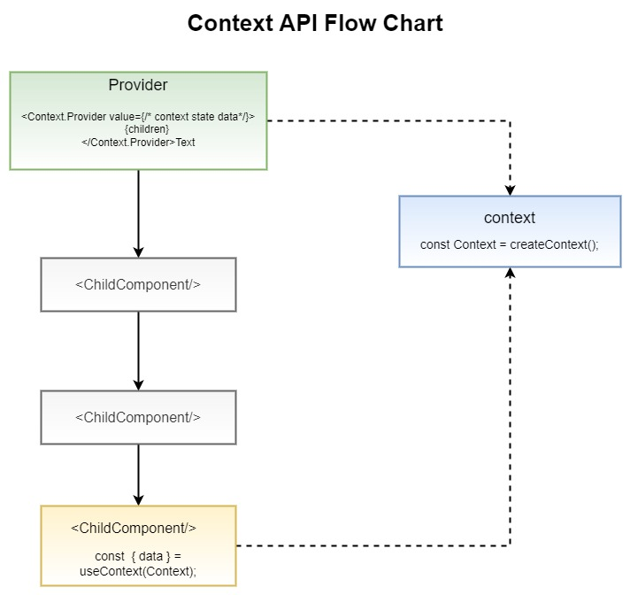
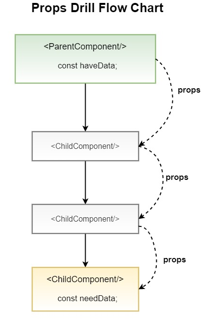

# ReactJS Context API Guide

## Table of Contents

1. [Introduction](#introduction)
1. [Steps to use Context API](#Steps to use Context API)


## Introduction

Context API is a state management tool. It provides a way to pass data through the component tree without having to pass downward manually in every level. 
It helps to prevent props driling.



**Props Drilling:**

It is the situation when the data of parent component is passed to every nested child component cause last child need that data.
It can cause unnecessary passing of data wether the nested component needed or not.




## Steps to use Context API

**1. Create context**
React.createContext is used to create context which return two object with  Provider and Consumer.


```javascript
import { createContext } from "react";

export const Context = createContext();
```

**2. Context Provider**
Context Provider keeps the data that is used or needed by the childern components.
It is placed in parent component.

```javascript
<Context.Provider value={/* context state data*/}>
      {children}
</Context.Provider>
```


**3. Context Consumer**
Context Consumer consumers the data provided by the provider. It basically helps child component to get data or value from provider.

```javascript
function AppChild() {
      const  { data } = useContext(Context);

      return (
            <section>
                  <p>Context state value: {data}</p>
            </section>
      )
}
```